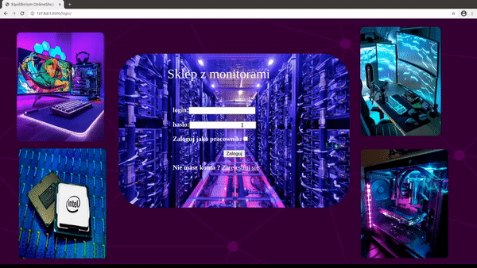
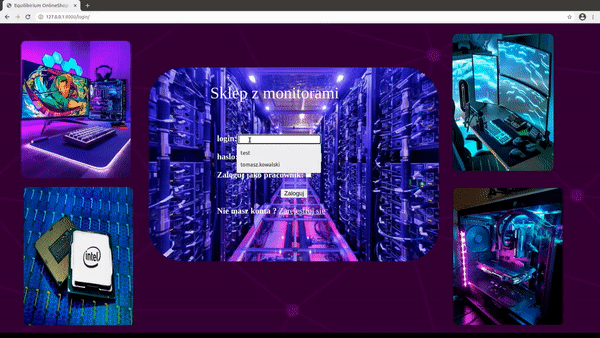

# Monitor Shop

#### Link to my demo app deployed on heroku
##### https://equilibrium-online-shop.herokuapp.com/

### Content
* [App description](#app-description)
* [Presentation of the application](#app-presentation)
* [Database structure](#database)
* [Technologies](#technologies)

## App Description
#### My app (shop with monitors) is created for two types of users :
  - #####  shop clients are able to:
    - ###### login
    - ###### search and filters monitors 
    - ###### make an order
    - ###### add an opinion
    - ###### submit a refund 
    - ###### add and set main adress
  - ##### shop admins are able to:
    - ###### login
    - ###### explore database
    - ###### add/update/delete some records

## Presentation of the application
##### Interface and database are Polish because app was created for 'Databases 1' - 2020 course.  
### User view

### Admin view

## Database structure

## Technologies
 - Front-end: HTML5,CSS3,Django templates
 - Back-end: Django
 - Database: postgreSQL, psycopg2
